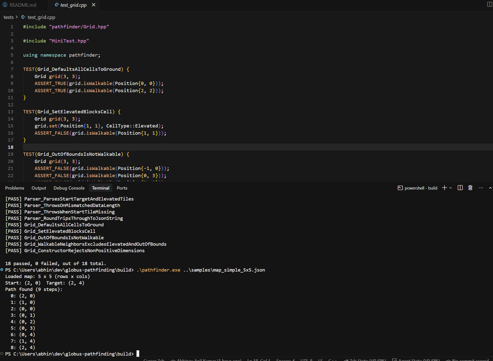
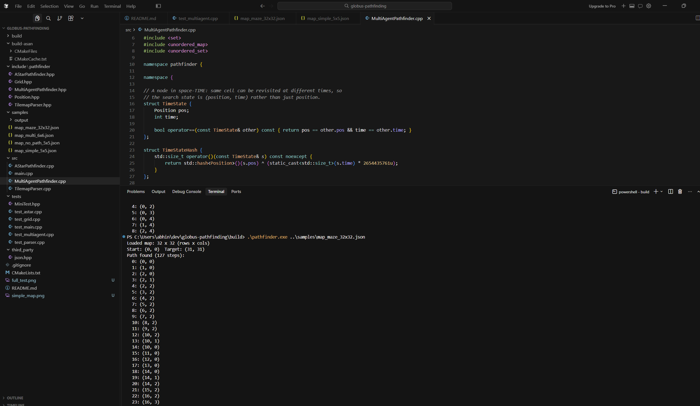
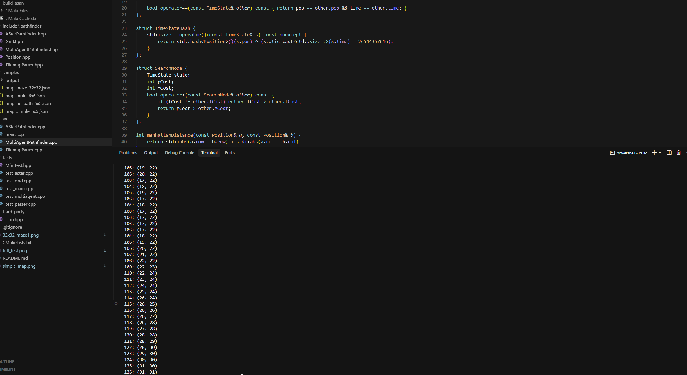
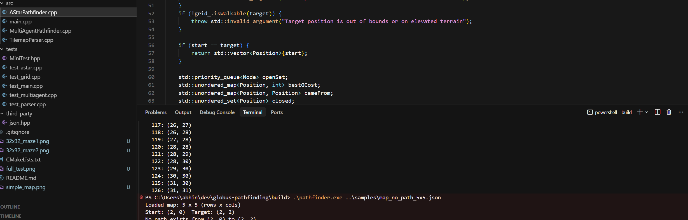
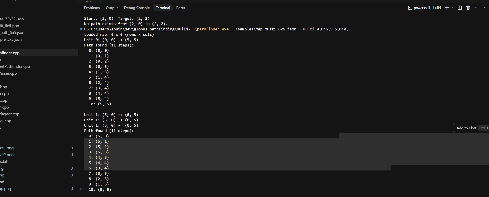
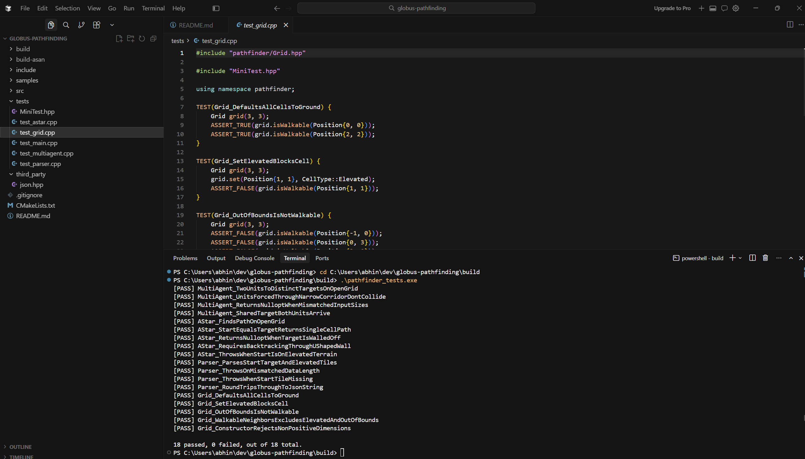

# Globus Medical — Software Candidate Assessment
### RTS Battle-Unit Pathfinding

This is my solution to the RTS battle-unit pathfinding assessment: given a grid map of
walkable ("ground") and blocked ("elevated") terrain, plus a unit's start and target
position, the program finds a step-by-step path between them. It also covers the
optional bonus task — routing multiple units at once without any of them colliding.

I wrote it in C++20 (the assessment's follow-up email asked for C++20 specifically,
even though the job description just says "C++17 and later") with a plain text-based
CLI, since the brief says the UI can be minimal for a backend-track candidate.

---

## 1. Design Decisions

### Algorithm choice: A* over BFS/DFS
BFS and A* both guarantee a shortest path on this kind of unweighted grid, but A* uses
a Manhattan-distance heuristic (valid since movement is strictly 4-directional) to
explore far fewer cells, especially on larger or maze-like maps. It also backtracks
naturally — it re-expands a cell whenever it finds a cheaper route to it, so it can't
get permanently stuck the way a naive "always step toward the target" walker would in a
maze. That's exercised directly by `AStar_RequiresBacktrackingThroughUShapedWall`.

### Multi-unit routing: prioritized planning with space-time A*
Each unit is planned one at a time, in the order given. Every unit's search runs in
space-time — its state is `(position, time)` rather than just `position` — against a
shared reservation table of cells already claimed by earlier units. A unit can also
wait in place for a step, which lets it yield to another unit in a narrow corridor
instead of failing outright.

This is a standard approach (often called prioritized planning), not a fully optimal
multi-agent solver like Conflict-Based Search. It won't always find a solution in every
theoretically solvable case, but it's simple to read and test, and it's plenty for the
grid sizes this assessment targets.

### Ambiguity: tile ID meanings
The brief says tile meanings depend on the icon set without pinning one down, so I used
the mapping given in its bullet list: `0` = start, `8` = target, `3` = elevated/blocked,
`-1` = ground. Any other tile value is treated as walkable ground rather than an
obstacle, so unknown or decorative tile IDs in a real exported map don't silently make
the level unsolvable. Documented in `TilemapParser.hpp`.

### Ambiguity: shared targets vs. one unit per cell
The brief allows multiple units to move toward a shared target, but also says at most
one unit can occupy a ground position at any moment. Taken literally forever, those two
rules conflict — if a unit held its final cell for all time, no second unit could ever
reach the same target. I resolved this by having a unit "leave the battlefield" the
instant it finishes its path, rather than occupying its last cell forever. That keeps
the one-unit-per-cell rule intact for every step a unit is actually on the board, while
still making shared targets work. See `positionAtTime` in `MultiAgentPathfinder.cpp` and
the test `MultiAgent_SharedTargetBothUnitsArrive`.

### Test framework: a small self-contained one, not a fetched dependency
Rather than pulling in GoogleTest or Catch2, I wrote a small self-contained header
(`tests/MiniTest.hpp`, ~70 lines) with `TEST` and `ASSERT_TRUE/FALSE/EQ`. It's not
trying to compete with a real framework — it just keeps the build reproducible without
needing a fetched dependency or internet access on a reviewer's machine.

### Third-party library: nlohmann/json (header-only)
JSON parsing/writing uses [nlohmann/json](https://github.com/nlohmann/json) v3.11.3,
vendored directly as a single header in `third_party/json.hpp`. It's the only
third-party dependency in the whole project — everything else (pathfinding, CLI, tests)
is written from scratch. I didn't want to hand-roll a JSON parser for a part of the
project that isn't really what's being assessed.

---

## 2. Project Structure

```
globus-pathfinding/
├── CMakeLists.txt              Build configuration (library + CLI + tests)
├── README.md                   This file
├── include/pathfinder/
│   ├── Position.hpp            A single (row, col) grid coordinate
│   ├── Grid.hpp                The battlefield: terrain grid + walkability queries
│   ├── TilemapParser.hpp       RiskyLab Tilemap JSON <-> Grid conversion
│   ├── AStarPathfinder.hpp     Single-unit shortest-path search
│   └── MultiAgentPathfinder.hpp  Optional bonus: multi-unit collision-free routing
├── src/
│   ├── TilemapParser.cpp
│   ├── AStarPathfinder.cpp
│   ├── MultiAgentPathfinder.cpp
│   └── main.cpp                 CLI entry point
├── tests/
│   ├── MiniTest.hpp              Minimal self-contained test framework
│   ├── test_main.cpp
│   ├── test_grid.cpp
│   ├── test_parser.cpp
│   ├── test_astar.cpp
│   └── test_multiagent.cpp
├── third_party/
│   └── json.hpp                  nlohmann/json v3.11.3 (vendored, header-only)
├── screenshots/                  Screenshots of sample runs (see section 4)
└── samples/
    ├── map_simple_5x5.json       Small hand-crafted map with a wall detour
    ├── map_no_path_5x5.json      Target fully walled off — exercises the "no path" case
    ├── map_maze_32x32.json       32x32 generated maze (meets the "at least 32x32" spec)
    ├── map_multi_6x6.json        Open map used for the multi-unit demo
    └── output/                   Captured sample run results (see section 4)
```

**Class responsibilities** — each one stays single-purpose and independently testable:
- `Grid` knows only about terrain — no notion of units, start/target, or JSON.
- `TilemapParser` only converts between the RiskyLab JSON format and a `Grid` (+ start/
  target positions). It doesn't know how pathfinding works.
- `AStarPathfinder` only knows how to search a `Grid`. It doesn't know about JSON or the
  CLI.
- `MultiAgentPathfinder` builds on the same `Grid` abstraction, independent of the
  single-unit pathfinder.
- `main.cpp` wires these together into a CLI and is the only place that touches
  `std::cout`/argv.

---

## 3. Build Instructions

**Requirements:** a C++20 compiler (tested with g++ 13) and CMake ≥ 3.15.

```bash
mkdir build && cd build
cmake ..
cmake --build .
```

This produces two executables in `build/`:
- `pathfinder` — the CLI
- `pathfinder_tests` — the test suite

Run the tests:
```bash
./pathfinder_tests
# or: ctest
```

### Running the CLI

**Single unit** (start/target read from the map's own `0`/`8` tiles):
```bash
./pathfinder ../samples/map_simple_5x5.json
```

**Multiple units** (bonus task — start:target pairs given on the command line,
`row,col:row,col`, space-separated):
```bash
./pathfinder ../samples/map_multi_6x6.json --multi 0,0:5,5 5,0:0,5
```

**Write the result back out** as a RiskyLab-Tilemap-format JSON file:
```bash
./pathfinder ../samples/map_simple_5x5.json --out result.json
```

### Windows notes

The machine I built and tested this on doesn't have `cmake`, `ninja`, or `make` on PATH
by default. Here's what actually worked, in case it's useful to a reviewer on a similar
setup:

- **CMake + Ninja**: both are bundled with VS Build Tools, under
  `...\Common7\IDE\CommonExtensions\Microsoft\CMake\CMake\bin\cmake.exe` (Ninja is in a
  sibling directory).
- **Compiler**: MSYS2's UCRT64 g++ (`C:\msys64\ucrt64\bin\g++.exe`).

```bash
CMAKE=".../Common7/IDE/CommonExtensions/Microsoft/CMake/CMake/bin/cmake.exe"
NINJA=".../Common7/IDE/CommonExtensions/Microsoft/CMake/Ninja/ninja.exe"
"$CMAKE" -S . -B build -G Ninja -DCMAKE_MAKE_PROGRAM="$NINJA" -DCMAKE_BUILD_TYPE=Release -DCMAKE_CXX_COMPILER=g++
"$CMAKE" --build build --config Release -j
```

One gotcha that cost some time: running the built `.exe` from Git Bash produces a
spurious "segmentation fault" even when the program and inputs are completely fine —
the exact same binary and arguments run cleanly from PowerShell or cmd. That's a
Git-Bash/MinGW-exe interop quirk, not a real crash, so on this machine I run compiled
binaries from PowerShell rather than Git Bash.

---

## 4. Sample Runs

All files referenced below are included under `samples/` and `samples/output/`, with
real captured output (not hand-written) from running the built binaries. Screenshots
are under `screenshots/`.

| Scenario | Input | Captured output | Screenshot |
|---|---|---|---|
| Small map requiring a detour around a wall | `samples/map_simple_5x5.json` | `samples/output/run_simple_5x5.txt`, `samples/output/map_simple_5x5_result.json` |  |
| 32×32 generated maze (satisfies "at least 32×32") | `samples/map_maze_32x32.json` | `samples/output/run_maze_32x32.txt`, `samples/output/map_maze_32x32_result.json` |   |
| Target fully walled off — no path exists | `samples/map_no_path_5x5.json` | `samples/output/run_no_path_5x5.txt` |  |
| Two units to distinct targets, collision-free (bonus) | `samples/map_multi_6x6.json` | `samples/output/run_multi_6x6.txt` |  |
| Full automated test suite | — | `samples/output/test_run_output.txt` (18/18 passing) |  |

Example — the small map (`map_simple_5x5.json`) is a 5×5 grid with a wall separating
start and target except for a single-cell gap in the middle:
```
. . . . .
. # # # .
S # . # T
. # # # .
. . . . .
```
The program finds the 9-step detour around the top of the wall (it can't cut through
the isolated open cell in the middle, since that cell has no connection to either
side):
```
Start: (2, 0)  Target: (2, 4)
Path found (9 steps):
  0: (2, 0)
  1: (1, 0)
  2: (0, 0)
  3: (0, 1)
  4: (0, 2)
  5: (0, 3)
  6: (0, 4)
  7: (1, 4)
  8: (2, 4)
```

---

## 5. Concerns / Notes on the Problem Statement

As requested by the "General Requirements" section, a few points where the brief was
ambiguous or underspecified, and how I resolved them:

1. **Tile ID meaning is icon-set-dependent** — resolved by using the literal mapping
   given in the brief and treating any other value as walkable ground (see section 1).
2. **"Common target" vs. "at most one unit per position at any moment"** are in tension
   if a unit is assumed to occupy its final cell forever — resolved by treating a unit
   as having left the battlefield once its path is complete (see section 1).
3. **The RiskyLab Tilemap sample link in the brief** wasn't directly accessible in this
   environment, so I inferred the JSON structure (`width`, `height`, `layers[0].data`)
   from the brief's own description ("The `layers[0].data` field... has *row x columns*
   entries") rather than a fetched sample file. The parser validates this shape
   explicitly and raises a clear error if a real-world file doesn't match, rather than
   failing silently.
4. **Diagonal movement** is explicitly disallowed by the brief ("travel horizontally...
   or vertically") — `Grid::walkableNeighbors` only considers the 4 orthogonal
   directions, and that's covered by a unit test.

---

## 6. On Using Claude

I used Claude Code throughout this project, and I want to be upfront about what it did
versus what I did.

**What Claude helped with:**
- Scaffolding the project — CMake setup, directory layout, initial class skeletons
- Writing the first pass of the A* and multi-agent pathfinding implementations
- Generating the test suite
- Debugging the Windows build: this machine doesn't have `cmake`, `ninja`, or `make` on
  PATH, so tracking down that VS Build Tools bundles its own CMake + Ninja, wiring that
  up with MSYS2's g++, chasing down the spurious Git-Bash segfault when running the
  built `.exe` (see the "Windows notes" above), and sorting out a PATH issue with `gh`
  all took a fair amount of back-and-forth
- Drafting documentation, including an earlier pass of this README

**What I did myself:**
- Made the actual design calls — choosing A* over BFS/DFS, picking prioritized planning
  with space-time A* for the multi-unit case, and resolving both ambiguities (tile IDs,
  shared targets vs. one-unit-per-cell)
- Verified every build and test result myself, on my own machine, rather than trusting
  reported output
- Reviewed and rewrote the generated comments and docs in my own words
- Made the scope and time-budget calls on what to build and how deep to go

I don't think there's anything wrong with using an AI assistant for this kind of work —
it's a normal part of how I write software now — but I'd rather the write-up reflect
that honestly than read like I typed every line myself.

---

## 7. Feedback on the Assessment

1. **Most helpful:** the explicit constraints section (discrete movement, 4-directional
   only, must handle backtracking) made the algorithm choice and test design
   unambiguous.
2. **Challenges:** the two ambiguities noted above (tile-ID mapping, and the
   common-target vs. exclusive-occupancy tension) took the most thought to resolve
   cleanly — see section 5.
3. **Could be clearer:** a concrete example RiskyLab Tilemap JSON snippet embedded
   directly in the brief (rather than only a link) would remove all doubt about the
   exact field names/shape expected.
4. **Suggestion:** since the JD is C++/robotics-specific, explicitly stating the
   expected language up front (rather than "agreed upon when you received the project")
   would help candidates gauge scope before starting.
